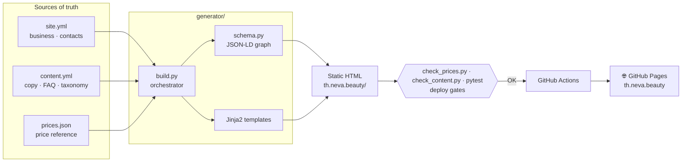

<p align="center">
  
</p>

<p align="center">
  <a href="README.md">🇷🇺 Русский</a> · <b>🇬🇧 English</b>
</p>

<p align="center">
  
  
  
  
  
  
  
</p>

<p align="center">
  🌐 <a href="https://th.neva.beauty"><b>th.neva.beauty</b></a> — live in production
</p>

---

## About

**Neva Beauty — Koh Samui** is the website of a beauty salon on Koh Samui, Thailand.
It serves Russian- and English-speaking clients: cosmetology and hardware procedures,
hair removal, hair care, body contouring and permanent makeup.

This is a **migration of a running business off the Tilda page builder onto a custom
static site generator** — the entire price list carried over intact, the copy rewritten
for search engines and AI assistants. Content lives in YAML/JSON, templates are Jinja2,
and the output is clean static HTML served for free from GitHub Pages on a custom
domain: no CMS, no database, no paid hosting, no builder subscription.

Everything a visitor sees is assembled from single sources of truth, and
**204 prices plus the quality of all 25 pages are guarded by automated checks inside
the deploy pipeline** — a wrong price or a broken link physically cannot reach production.

<table>
  <tr>
    <td align="center" width="33%">
      <br>
      <sub><b>Cosmetology</b></sub>
    </td>
    <td align="center" width="33%">
      <br>
      <sub><b>Hardware cosmetology</b></sub>
    </td>
    <td align="center" width="33%">
      <br>
      <sub><b>Hair removal</b></sub>
    </td>
  </tr>
  <tr>
    <td align="center" width="33%">
      <br>
      <sub><b>Hair</b></sub>
    </td>
    <td align="center" width="33%">
      <br>
      <sub><b>Body contouring</b></sub>
    </td>
    <td align="center" width="33%">
      <br>
      <sub><b>Permanent makeup</b></sub>
    </td>
  </tr>
</table>

---

## 🛠 Tech stack

| Area | Tools |
|---|---|
| **Language / build** | Python 3.12, custom generator `build.py` |
| **Templating** | Jinja2 (inheritance, macros, partials) |
| **Data** | YAML (`site.yml`, `content.yml`) + JSON (`prices.json`) |
| **SEO / AI data** | JSON-LD (schema.org) `@graph`, `sitemap.xml`, `llms.txt`, `robots.txt` |
| **Styling** | Plain CSS, nine cascade layers, minified into one bundle via `rcssmin` |
| **Fonts** | Self-hosted Cormorant + Manrope: instanced and subset from variable masters (`fontTools`) |
| **Graphics** | Inline SVG icons, responsive `WebP` (`Pillow`), decorative CSS backdrop with pointer parallax |
| **Testing** | 85 unit tests (`pytest`) + `check_prices.py` and `check_content.py` over the built site (BeautifulSoup4) |
| **Analytics** | Yandex.Metrica |
| **CI/CD** | GitHub Actions → GitHub Pages, custom domain via `CNAME` |

---

## 🏗 Architecture

A single generator pass turns data into a finished site. Data, markup and prices are
separated and each has a single source of truth; the build is deterministic and
reproducible in CI.



---

## ✨ Engineering highlights

- **🎯 Single source of truth for content.** The service taxonomy is declared once in
  `content.yml`; from it the generator derives navigation, breadcrumbs, category hub
  pages and “See also” cross-linking — sections can’t drift out of sync by design.
  A category holding a single service gets no page of its own and links straight to that
  service: the site has no empty wrapper pages.

- **💰 Price-accuracy guarantee.** `prices.json` is the only source of prices — 204 items.
  After the build, `check_prices.py` parses the generated HTML and compares against the
  reference not just the number, but the price-list section, the item caption and the
  promo label, failing on any mismatch. Prices are never duplicated in the copy either:
  `content.yml` carries a `{price:service:item}` placeholder that the build replaces with
  the figure from the price list — a service description and its FAQ cannot drift away
  from the table, even if someone forgets about them while editing.

- **🛡 Page quality under end-to-end checks.** `check_content.py` walks all 25 built pages
  and fails the build on a trace of the old brand, a broken internal link, a missing
  image, duplicate meta tags, a wrong OG image size, invalid JSON-LD, a skipped heading
  level — and even on a glyph missing from the subset fonts. That last one is the price
  of self-hosting: a single Latin letter in a device name would silently fall back to a
  system font, and only a human eye would catch it.

- **🔎 Connected structured-data graph.** `schema.py` assembles one valid JSON-LD
  `@graph` (`Organization` + `BeautySalon` + `WebSite`), and pages append their own nodes:
  `Service`, `FAQPage`, `BreadcrumbList`, `ItemList` and `OfferCatalog`, where **every
  price-list item is its own `Offer` with a numeric price**. The `AggregateOffer` range is
  derived from that same catalogue and cannot contradict it. Items that aren't sold
  separately (a thickness surcharge, a per-unit price for injectables) are flagged in the
  price list and stay out of the markup — otherwise the site would advertise a price you
  can't actually buy at.

- **🖼 Custom image pipeline.** The width ladder and `sizes` for every layout slot are
  declared once in `images.py`: the same table drives both the `WebP` derivative slicing
  and the `srcset` in the markup, so the browser can never request a file that doesn't
  exist. Master shots and the slicing rules live outside the published folder — only
  pixels somebody will actually download get deployed.

- **⚡ Performance.** Nine CSS layers are concatenated into one minified `bundle.min.css`
  (one render-blocking request instead of nine), the LCP image is preloaded, and fonts are
  instanced from variable masters: ten files and 220 KB became five and 70 KB. Page weight
  dropped 51–60% across own files — home 512 → 306 KB, service page 362 → 215 KB. Measured
  on the live domain (Lighthouse 13, mobile profile, median of three runs): Accessibility
  100, SEO 100, Performance 93–99, CLS 0. Best Practices sits at 77 — third-party cookies
  from Yandex.Metrica, the deliberate price of having analytics. Two "obvious"
  optimisations were A/B tested and rejected on measurement: inlining CSS into `<head>`
  made LCP worse, and deferring Metrica changed nothing.

- **📅 Honest `lastmod` in the sitemap.** A page's date changes only when its content
  changed: the build compares a digest of the HTML against a journal, with asset
  fingerprints excluded from it. Search engines don't get 25 "updated" pages after one
  comma is fixed in the stylesheet.

- **🌿 Preview and production from one build.** A `base_path` parameter prefixes asset
  links for a GitHub Pages sub-path preview and stays empty on the production domain —
  while SEO URLs are always absolute. `CNAME` is emitted into the artifact so the deploy
  never resets the custom domain.

- **🤖 `llms.txt` for AI assistants.** The generator publishes a machine-readable site map
  per the [llmstxt.org](https://llmstxt.org) standard — categories, services, prices, contacts.

---

## 📁 Project structure

```
.
├─ generator/                 # Static site generator (Python)
│  ├─ build.py                #   build orchestrator
│  ├─ schema.py               #   JSON-LD (schema.org) assembly
│  ├─ images.py               #   width ladder and sizes for responsive images
│  ├─ check_prices.py         #   price-parity test
│  ├─ check_content.py        #   end-to-end page quality checks
│  ├─ make_images.py          #   WebP derivative slicing (run manually)
│  ├─ make_fonts.py           #   font instancing and subsetting (run manually)
│  ├─ data/
│  │  ├─ site.yml             #   business, contacts, config
│  │  ├─ content.yml          #   copy, FAQ, taxonomy
│  │  ├─ prices.json          #   price reference (source of truth)
│  │  └─ lastmod.json         #   page digest journal for the sitemap
│  ├─ sources/                #   build inputs: css · icons · img · fonts
│  ├─ templates/              #   Jinja2 templates and partials
│  └─ tests/                  #   85 unit tests (pytest)
│
├─ th.neva.beauty/            # Generated site (served by GitHub Pages)
│  ├─ index.html · <services>/ · <categories>/
│  ├─ assets/  css · js · fonts · img
│  ├─ sitemap.xml · llms.txt · robots.txt · CNAME · 404.html
│
├─ docs/                      # Spec, build plan, audit reports
├─ .github/workflows/         # CI/CD: build, checks, deploy
└─ requirements.txt
```

The published folder holds **only what a browser downloads**. Everything it was built
from — CSS layers, SVG icons, master shots, variable font masters — lives in
`generator/sources/` and never ships.

---

## 🚀 Run locally

```bash
# 1. Dependencies
python -m venv .venv && source .venv/bin/activate
pip install -r requirements.txt

# 2. Build the site into th.neva.beauty/
python generator/build.py

# 3. Gates: price accuracy, page quality, unit tests
cd generator && python check_prices.py && cd ..
python generator/check_content.py
pytest generator/tests -q

# 4. Preview locally
python -m http.server -d th.neva.beauty 8000
# → http://localhost:8000
```

## ☁️ Deployment

Pushing to `main` triggers GitHub Actions: the workflow installs dependencies, runs
`build.py`, runs all three checks, uploads the `th.neva.beauty/` folder as an artifact
and deploys to GitHub Pages. The production domain `th.neva.beauty` is wired up
via `CNAME`.

---

## 🧭 Site content

**6 categories · 17 services · 204 price-list items · 25 pages**, with the structure
generated automatically from the taxonomy:

| Category | Services |
|---|---|
| **Hair** | care and colouring · Tokio Inkarami · perm · keratin straightening · Davines Naturaltech |
| **Hair removal** | laser · electrolysis · sugaring |
| **Hardware cosmetology** | RF microneedling · SMAS lifting · tattoo and PMU removal · M22 photorejuvenation |
| **Cosmetology** | facial care · botulinum therapy |
| **Body contouring** | endosphere therapy · professional massage |
| **Permanent makeup** | permanent makeup |

---

<p align="center">
  <sub>Development and design — portfolio project. Procedure photos — salon materials.</sub><br>
  <sub>Provenance of every shot is tracked in <code>generator/sources/img/CREDITS.txt</code>.</sub>
</p>
