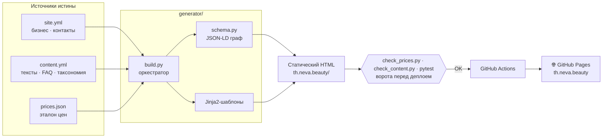

<p align="center">
  
</p>

<p align="center">
  <b>🇷🇺 Русский</b> · <a href="README.en.md">🇬🇧 English</a>
</p>

<p align="center">
  
  
  
  
  
  
  
</p>

<p align="center">
  🌐 <a href="https://th.neva.beauty"><b>th.neva.beauty</b></a> — сайт в продакшене
</p>

---

## О проекте

**Neva Beauty — Koh Samui** — сайт салона красоты на острове Самуи (Таиланд).
Обслуживание на русском и английском: косметология и аппаратные процедуры, эпиляция,
уход за волосами, коррекция фигуры, перманентный макияж.

Это **перенос действующего салона с конструктора Tilda на собственный статический
генератор** — с полным сохранением прайса и переработкой контента под поиск и
ИИ-ассистентов. Контент описан в YAML/JSON, шаблоны — на Jinja2, на выходе чистый
статический HTML, который бесплатно раздаётся с GitHub Pages на своём домене:
ни CMS, ни базы, ни платного хостинга, ни абонентской платы за конструктор.

Всё, что клиент видит на сайте, собирается из единых источников истины, а
**204 цены и качество каждой из 25 страниц защищены автотестами в конвейере
деплоя** — ошибка в цене или битая ссылка физически не доезжают до прода.

<table>
  <tr>
    <td align="center" width="33%">
      <br>
      <sub><b>Косметология</b></sub>
    </td>
    <td align="center" width="33%">
      <br>
      <sub><b>Аппаратная косметология</b></sub>
    </td>
    <td align="center" width="33%">
      <br>
      <sub><b>Эпиляция</b></sub>
    </td>
  </tr>
  <tr>
    <td align="center" width="33%">
      <br>
      <sub><b>Волосы</b></sub>
    </td>
    <td align="center" width="33%">
      <br>
      <sub><b>Коррекция фигуры</b></sub>
    </td>
    <td align="center" width="33%">
      <br>
      <sub><b>Перманентный макияж</b></sub>
    </td>
  </tr>
</table>

---

## 🛠 Технологии

| Область | Инструменты |
|---|---|
| **Язык / сборка** | Python 3.12, собственный генератор `build.py` |
| **Шаблоны** | Jinja2 (наследование, макросы, партиалы) |
| **Данные** | YAML (`site.yml`, `content.yml`) + JSON (`prices.json`) |
| **SEO / данные для ИИ** | JSON-LD (schema.org) `@graph`, `sitemap.xml`, `llms.txt`, `robots.txt` |
| **Стили** | Чистый CSS, девять слоёв по каскаду, минификация `rcssmin` в один бандл |
| **Шрифты** | Самохостинг Cormorant + Manrope: инстансы и сабсеты из вариативных мастеров (`fontTools`) |
| **Графика** | SVG-иконки inline, адаптивный `WebP` (`Pillow`), декоративный CSS-фон с pointer-parallax |
| **Тесты** | 85 unit-тестов (`pytest`) + `check_prices.py` и `check_content.py` по собранному сайту (BeautifulSoup4) |
| **Аналитика** | Яндекс.Метрика |
| **CI/CD** | GitHub Actions → GitHub Pages, кастомный домен через `CNAME` |

---

## 🏗 Архитектура

Один проход генератора превращает данные в готовый сайт. Данные, разметка и цены
разделены и имеют единый источник истины; сборка детерминирована и воспроизводима в CI.



---

## ✨ Ключевые инженерные решения

- **🎯 Единый источник истины для контента.** Таксономия направлений задаётся один раз
  в `content.yml`; из неё генератор строит навигацию, хлебные крошки, страницы-разделы
  и перелинковку «Смотрите также» — рассинхрон между разделами невозможен by design.
  Раздел из одной услуги страницы не получает и ведёт прямо на неё: пустых страниц-обёрток
  на сайте нет.

- **💰 Гарантия точности цен.** `prices.json` — единственный источник цен, 204 позиции.
  После сборки `check_prices.py` парсит готовый HTML и сверяет с эталоном не только
  цифру, но и раздел прайса, подпись позиции и метку акции, падая при любом расхождении.
  Цены не дублируются и в текстах: в `content.yml` стоит плейсхолдер
  `{price:услуга:позиция}`, который сборка заменяет цифрой из прайса, — описание услуги
  и её FAQ не могут разойтись с таблицей цен, даже если про них забыли при правке.

- **🛡 Качество страниц под сквозной проверкой.** `check_content.py` проходит по всем
  25 собранным страницам и роняет сборку на следе старого бренда, битой внутренней
  ссылке, отсутствующем изображении, дубле метатегов, неверном размере OG-картинки,
  невалидном JSON-LD, сбитой иерархии заголовков и даже на знаке, которого нет
  в подрезанных шрифтах. Последнее — цена самохостинга: одна латинская буква в названии
  аппарата отрисовалась бы системным шрифтом, и это заметно только глазом.

- **🔎 Связный граф структурированных данных.** `schema.py` собирает один валидный
  JSON-LD `@graph` (`Organization` + `BeautySalon` + `WebSite`), к которому страницы
  добавляют свои узлы: `Service`, `FAQPage`, `BreadcrumbList`, `ItemList` и `OfferCatalog`,
  где **каждая позиция прайса — отдельный `Offer` с ценой числом**. Диапазон
  в `AggregateOffer` считается из того же каталога и разойтись с ним не может.
  Позиции, которые отдельно не продаются (надбавка за густоту, цена за единицу
  препарата), помечены флагом в прайсе и в разметку не попадают: иначе сайт заявил бы
  цену, по которой купить нельзя.

- **🖼 Свой пайплайн изображений.** Таблица ширин и `sizes` для каждого места вёрстки
  описана один раз в `images.py`: по ней и режутся `WebP`-производные, и подставляется
  `srcset` в разметку — браузер не может попросить файл, которого нет. Мастер-кадры
  и нарезка держатся вне публикуемой папки, в деплой уезжают только те пиксели,
  которые кто-то скачает.

- **⚡ Оптимизация скорости.** Девять CSS-слоёв склеиваются в один минифицированный
  `bundle.min.css` (один render-blocking запрос вместо девяти), LCP-изображение
  прелоадится, шрифты нарезаны из вариативных мастеров: десять файлов и 220 КБ
  превратились в пять и 70 КБ. Вес страниц упал на 51–60% по своим файлам —
  главная 512 → 306 КБ, страница услуги 362 → 215 КБ. Замер боевого домена
  (Lighthouse 13, мобильный профиль, медиана трёх прогонов): Accessibility 100,
  SEO 100, Performance 93–99, CLS 0. Best Practices 77 — сторонние куки
  Яндекс.Метрики, осознанная цена подключённой аналитики.
  Две «очевидные» оптимизации проверены A/B и отвергнуты замером: встраивание CSS
  в `<head>` ухудшало LCP, отложенная Метрика не меняла ничего.

- **📅 Честный `lastmod` в sitemap.** Дата страницы меняется, только если изменилось
  её содержимое: сборка сверяет отпечаток HTML с журналом, исключая из него отпечатки
  ассетов. Поисковик не получает 25 «обновлённых» страниц после правки одной запятой
  в стилях.

- **🌿 Превью и прод из одной сборки.** Параметр `base_path` префиксует ссылки на ассеты
  для превью на GitHub Pages по подпути проекта и остаётся пустым на боевом домене —
  SEO-URL при этом всегда абсолютные. `CNAME` кладётся в артефакт, чтобы деплой
  не сбрасывал кастомный домен.

- **🤖 `llms.txt` для ИИ-ассистентов.** Генератор публикует машиночитаемую карту сайта
  по стандарту [llmstxt.org](https://llmstxt.org) — направления, услуги, цены и контакты.

---

## 📁 Структура проекта

```
.
├─ generator/                 # Статический генератор (Python)
│  ├─ build.py                #   оркестратор сборки
│  ├─ schema.py               #   сборка JSON-LD (schema.org)
│  ├─ images.py               #   таблица ширин и sizes для адаптивных картинок
│  ├─ check_prices.py         #   парити-тест цен
│  ├─ check_content.py        #   сквозные проверки качества страниц
│  ├─ make_images.py          #   нарезка WebP-производных (запуск вручную)
│  ├─ make_fonts.py           #   инстансы и сабсеты шрифтов (запуск вручную)
│  ├─ data/
│  │  ├─ site.yml             #   бизнес, контакты, конфиг
│  │  ├─ content.yml          #   тексты, FAQ, таксономия
│  │  ├─ prices.json          #   эталон цен (источник истины)
│  │  └─ lastmod.json         #   журнал отпечатков страниц для sitemap
│  ├─ sources/                #   исходники: css · icons · img · fonts
│  ├─ templates/              #   Jinja2-шаблоны и партиалы
│  └─ tests/                  #   85 unit-тестов (pytest)
│
├─ th.neva.beauty/            # Сгенерированный сайт (раздаётся GitHub Pages)
│  ├─ index.html · <услуги>/ · <разделы>/
│  ├─ assets/  css · js · fonts · img
│  ├─ sitemap.xml · llms.txt · robots.txt · CNAME · 404.html
│
├─ docs/                      # Спека, план сборки, отчёты аудитов
├─ .github/workflows/         # CI/CD: сборка, проверки, деплой
└─ requirements.txt
```

В публикуемой папке лежит **только то, что скачивает браузер**. Всё, из чего это
собрано, — CSS-слои, SVG-иконки, мастер-кадры, вариативные мастера шрифтов —
живёт в `generator/sources/` и в деплой не попадает.

---

## 🚀 Локальный запуск

```bash
# 1. Зависимости
python -m venv .venv && source .venv/bin/activate
pip install -r requirements.txt

# 2. Сборка сайта в th.neva.beauty/
python generator/build.py

# 3. Ворота: точность цен, качество страниц, unit-тесты
cd generator && python check_prices.py && cd ..
python generator/check_content.py
pytest generator/tests -q

# 4. Локальный просмотр
python -m http.server -d th.neva.beauty 8000
# → http://localhost:8000
```

## ☁️ Деплой

Пуш в `main` запускает GitHub Actions: workflow ставит зависимости, гоняет `build.py`,
прогоняет все три проверки, публикует папку `th.neva.beauty/` артефактом и деплоит
на GitHub Pages. Боевой домен `th.neva.beauty` подключён через `CNAME`.

---

## 🧭 Контент сайта

**6 направлений · 17 услуг · 204 позиции прайса · 25 страниц**, структура
генерируется из таксономии автоматически:

| Направление | Услуги |
|---|---|
| **Волосы** | уход и окрашивание · Tokio Inkarami · биозавивка · кератиновое выпрямление · Davines Naturaltech |
| **Эпиляция** | лазерная · электроэпиляция · сахарная |
| **Аппаратная косметология** | игольчатый РФ-лифтинг · SMAS-лифтинг · удаление тату и татуажа · фотоомоложение M22 |
| **Косметология** | уходовая косметология · ботулинотерапия |
| **Коррекция фигуры** | эндосфера-терапия · профессиональный массаж |
| **Перманентный макияж** | перманентный макияж |

---

<p align="center">
  <sub>Разработка и дизайн — портфолио-проект. Изображения процедур — материалы салона.</sub><br>
  <sub>Происхождение каждого кадра — в <code>generator/sources/img/CREDITS.txt</code>.</sub>
</p>
